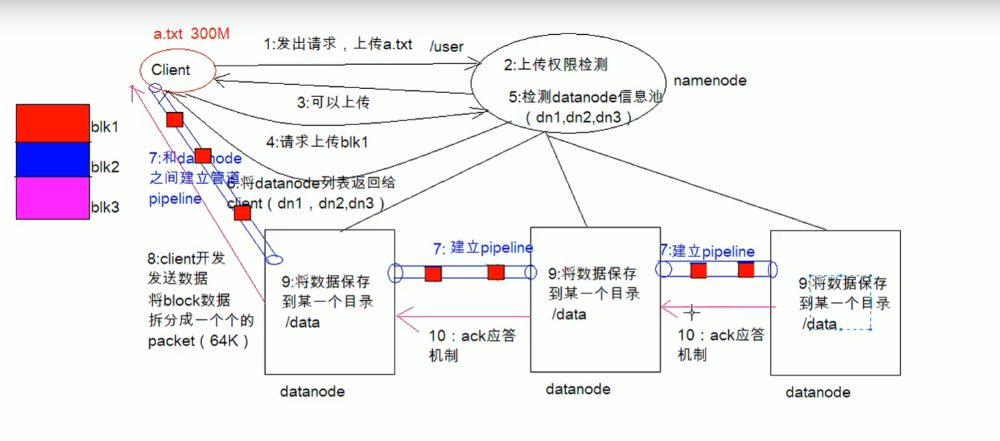

# Hadoop 02 核心介绍

## 1. HDFS

* HDFS（Hadoop  Distributed  File  System） 是一个 Apache Software Foundation 项目, 是 Apache Hadoop 项目的一个子项目. Hadoop 非常适于存储大型数据 (比如 TB 和 PB), 其就是使用 HDFS 作为存储系统. HDFS 使用多台计算机存储文件, 并且提供统一的访问接口, 像是访问一个普通文件系统一样使用分布式文件系统. HDFS 对数据文件的访问通过流的方式进行处理, 这意味着通过命令和 MapReduce 程序的方式可以直接使用 HDFS. HDFS 是容错的, 且提供对大数据集的高吞吐量访问.

* HDFS 的一个非常重要的特点就是**一次写入、多次读取**, 该模型降低了对并发控制的要求, 简化了数据聚合性, 支持高吞吐量访问. 而吞吐量是大数据系统的一个非常重要的指标, 吞吐量高意味着能处理的数据量就大.

### 1.1. 设计目标

- 通过跨多个廉价计算机集群分布数据和处理来节约成本
- 通过自动维护多个数据副本和在故障发生时来实现可靠性
- 它们为存储和处理超大规模数据提供所需的扩展能力。

### 1.2. HDFS 的历史

1. Doug Cutting 在做 Lucene 的时候, 需要编写一个爬虫服务, 这个爬虫写的并不顺利, 遇到了一些问题, 诸如: 如何存储大规模的数据, 如何保证集群的可伸缩性, 如何动态容错等
2. 2013年的时候, Google 发布了三篇论文, 被称作为三驾马车, 其中有一篇叫做 GFS, 是描述了 Google 内部的一个叫做 GFS 的分布式大规模文件系统, 具有强大的可伸缩性和容错性
3. Doug Cutting 后来根据 GFS 的论文, 创造了一个新的文件系统, 叫做 HDFS

### 1.3. HDFS 的架构


1. NameNode 是一个中心服务器, 单一节点(简化系统的设计和实现), 负责管理文件系统的名字空间(NameSpace)以及客户端对文件的访问
2. 文件操作, NameNode 是负责文件元数据的操作, DataNode 负责处理文件内容的读写请求, 跟文件内容相关的数据流不经过 NameNode, 只询问它跟哪个 DataNode联系, 否则 NameNode 会成为系统的瓶颈
3. 副本存放在哪些 DataNode 上由 NameNode 来控制, 根据全局情况作出块放置决定, 读取文件时 NameNode 尽量让用户先读取最近的副本, 降低读取网络开销和读取延时
4. NameNode 全权管理数据库的复制, 它周期性的从集群中的每个 DataNode 接收心跳信合和状态报告, 接收到心跳信号意味着 DataNode 节点工作正常, 块状态报告包含了一个该 DataNode 上所有的数据列表

| NameNode                             | DataNode                                   |
| :----------------------------------- | :----------------------------------------- |
| 存储元数据                           | 存储文件内容                               |
| 元数据保存在内存中                   | 文件内容保存在磁盘                         |
| 保存文件, block, DataNode 之间的关系 | 维护了 block id 到 DataNode 文件之间的关系 |

### 1.4. HDFS 文件副本和 Block 块存储


所有的文件都是以 block 块的方式存放在 HDFS 文件系统当中, 在 Hadoop1 当中, 文件的 block 块默认大小是 64M, hadoop2 当中, 文件的 block 块大小默认是 128M, block 块的大小可以通过 hdfs-site.xml 当中的配置文件进行指定

```
<property>
    <name>dfs.block.size</name>
    <value>块大小 以字节为单位</value>
</property>
```

#### 1.4.1. 引入块机制的好处

1. 一个文件有可能大于集群中任意一个磁盘
2. 使用块抽象而不是文件可以简化存储子系统
3. 块非常适合用于数据备份进而提供数据容错能力和可用性

#### 1.4.2. 块缓存

通常 DataNode 从磁盘中读取块, 但对于访问频繁的文件, 其对应的块可能被显式的缓存在 DataNode 的内存中, 以堆外块缓存的形式存在. 默认情况下，一个块仅缓存在一个 DataNode 的内存中，当然可以针对每个文件配置 DataNode 的数量. 作业调度器通过在缓存块的 DataNode 上运行任务, 可以利用块缓存的优势提高读操作的性能.

例如：

连接(join) 操作中使用的一个小的查询表就是块缓存的一个很好的候选

用户或应用通过在缓存池中增加一个 Cache Directive 来告诉 NameNode 需要缓存哪些文件及存多久. 缓存池(Cache Pool) 是一个拥有管理缓存权限和资源使用的管理性分组.

例如一个文件 130M, 会被切分成 2 个 block 块, 保存在两个 block 块里面, 实际占用磁盘 130M 空间, 而不是占用256M的磁盘空间

#### 1.4.3. HDFS 文件权限验证

HDFS 的文件权限机制与 Linux 系统的文件权限机制类似

```
r:read  w:write  x:execute
```

权限 `x` 对于文件表示忽略, 对于文件夹表示是否有权限访问其内容 如果 Linux 系统用户 zhangsan 使用 Hadoop 命令创建一个文件, 那么这个文件在 HDFS 当中的 Owner 就是 zhangsan HDFS 文件权限的目的, 防止好人做错事, 而不是阻止坏人做坏事. HDFS相信你告诉我你是谁, 你就是谁

### 1.5. HDFS 的元信息和 SecondaryNameNode

当 Hadoop 的集群当中, 只有一个 NameNode 的时候, 所有的元数据信息都保存在了 FsImage 与 Eidts 文件当中, 这两个文件就记录了所有的数据的元数据信息, 元数据信息的保存目录配置在了 `hdfs-site.xml` 当中

```
<property>
  <name>dfs.namenode.name.dir</name>
  <value>file:///export/servers/hadoop-3.1.1/datas/namenode/namenodedatas</value>
</property>
<property>
  <name>dfs.namenode.edits.dir</name>
  <value>file:///export/servers/hadoop-3.1.1/datas/dfs/nn/edits</value>
</property>
```

#### 1.5.1. FsImage 和 Edits 详解

- `edits`
  - `edits` 存放了客户端最近一段时间的操作日志
  - 客户端对 HDFS 进行写文件时会首先被记录在 `edits` 文件中
  - `edits` 修改时元数据也会更新
  - 每次 HDFS 更新时 `edits` 先更新后客户端才会看到最新信息
- `fsimage`
  - NameNode 中关于元数据的镜像, 一般称为检查点, `fsimage` 存放了一份比较完整的元数据信息
  - 因为 `fsimage` 是 NameNode 的完整的镜像, 如果每次都加载到内存生成树状拓扑结构，这是非常耗内存和CPU, 所以一般开始时对 NameNode 的操作都放在 edits 中
  - `fsimage` 内容包含了 NameNode 管理下的所有 DataNode 文件及文件 block 及 block 所在的 DataNode 的元数据信息.
  - 随着 `edits` 内容增大, 就需要在一定时间点和 `fsimage` 合并

#### 1.5.2. fsimage 中的文件信息查看

[官方查看文档](http://hadoop.apache.org/docs/r3.1.1/hadoop-project-dist/hadoop-hdfs/HdfsImageViewer.html)

使用命令 `hdfs  oiv`

```
cd /export/servers/hadoop-3.1.1/datas/namenode/namenodedatas
hdfs oiv -i fsimage_0000000000000000864 -p XML -o hello.xml
```

#### 1.5.3. edits 中的文件信息查看

[官方查看文档](http://archive.cloudera.com/cdh5/cdh/5/hadoop-2.6.0-cdh5.14.0/hadoop-project-dist/hadoop-hdfs/HdfsEditsViewer.html)

使用命令 `hdfs  oev`

```
cd /export/servers/hadoop-3.1.1/datas/dfs/nn/edits
hdfs oev -i  edits_0000000000000000865-0000000000000000866 -o myedit.xml -p XML
```

#### 1.5.4. SecondaryNameNode 如何辅助管理 fsimage 与 edits 文件?

- SecondaryNameNode 定期合并 fsimage 和 edits, 把 edits 控制在一个范围内

- 配置 SecondaryNameNode

  - SecondaryNameNode 在 `conf/masters` 中指定

  - 在 masters 指定的机器上, 修改 `hdfs-site.xml`

    ```
    <property>
      <name>dfs.http.address</name>
      <value>host:50070</value>
    </property>
    ```

  - 修改 `core-site.xml`, 这一步不做配置保持默认也可以

    ```
    <!-- 多久记录一次 HDFS 镜像, 默认 1小时 -->
    <property>
      <name>fs.checkpoint.period</name>
      <value>3600</value>
    </property>
    <!-- 一次记录多大, 默认 64M -->
      <name>fs.checkpoint.size</name>
      <value>67108864</value>
    </property>
    ```


1. SecondaryNameNode 通知 NameNode 切换 editlog
2. SecondaryNameNode 从 NameNode 中获得 fsimage 和 editlog(通过http方式)
3. SecondaryNameNode 将 fsimage 载入内存, 然后开始合并 editlog, 合并之后成为新的 fsimage
4. SecondaryNameNode 将新的 fsimage 发回给 NameNode
5. NameNode 用新的 fsimage 替换旧的 fsimage

##### 特点

- 完成合并的是 SecondaryNameNode, 会请求 NameNode 停止使用 edits, 暂时将新写操作放入一个新的文件中 `edits.new`
- SecondaryNameNode 从 NameNode 中通过 Http GET 获得 edits, 因为要和 fsimage 合并, 所以也是通过 Http Get 的方式把 fsimage 加载到内存, 然后逐一执行具体对文件系统的操作, 与 fsimage 合并, 生成新的 fsimage, 然后通过 Http POST 的方式把 fsimage 发送给 NameNode. NameNode 从 SecondaryNameNode 获得了 fsimage 后会把原有的 fsimage 替换为新的 fsimage, 把 edits.new 变成 edits. 同时会更新 fstime
- Hadoop 进入安全模式时需要管理员使用 dfsadmin 的 save namespace 来创建新的检查点
- SecondaryNameNode 在合并 edits 和 fsimage 时需要消耗的内存和 NameNode 差不多, 所以一般把 NameNode 和 SecondaryNameNode 放在不同的机器上

### 1.6 HDFS 文件写入过程



1. Client 发起文件上传请求, 通过 RPC 与 NameNode 建立通讯, NameNode 检查目标文件是否已存在, 父目录是否存在, 返回是否可以上传
2. Client 请求第一个 block 该传输到哪些 DataNode 服务器上
3. NameNode 根据配置文件中指定的备份数量及机架感知原理进行文件分配, 返回可用的 DataNode 的地址如: A, B, C
   - Hadoop 在设计时考虑到数据的安全与高效, 数据文件默认在 HDFS 上存放三份, 存储策略为本地一份, 同机架内其它某一节点上一份, 不同机架的某一节点上一份。
4. Client 请求 3 台 DataNode 中的一台 A 上传数据（本质上是一个 RPC 调用，建立 pipeline ）, A 收到请求会继续调用 B, 然后 B 调用 C, 将整个 pipeline 建立完成, 后逐级返回 client
5. Client 开始往 A 上传第一个 block（先从磁盘读取数据放到一个本地内存缓存）, 以 packet 为单位（默认64K）, A 收到一个 packet 就会传给 B, B 传给 C. A 每传一个 packet 会放入一个应答队列等待应答
6. 数据被分割成一个个 packet 数据包在 pipeline 上依次传输, 在 pipeline 反方向上, 逐个发送 ack（命令正确应答）, 最终由 pipeline 中第一个 DataNode 节点 A 将 pipelineack 发送给 Client
7. 当一个 block 传输完成之后, Client 再次请求 NameNode 上传第二个 block 到服务 1

### 1.7. HDFS 文件读取过程


1. Client向NameNode发起RPC请求，来确定请求文件block所在的位置；

2. NameNode会视情况返回文件的部分或者全部block列表，对于每个block，NameNode 都会返回含有该 block 副本的 DataNode 地址；  这些返回的 DN 地址，会按照集群拓扑结构得出 DataNode 与客户端的距离，然后进行排序，排序两个规则：网络拓扑结构中距离 Client 近的排靠前；心跳机制中超时汇报的 DN 状态为 STALE，这样的排靠后；

3. Client 选取排序靠前的 DataNode 来读取 block，如果客户端本身就是DataNode,那么将从本地直接获取数据(短路读取特性)；

4. 底层上本质是建立 Socket Stream（FSDataInputStream），重复的调用父类 DataInputStream 的 read 方法，直到这个块上的数据读取完毕；

5. 当读完列表的 block 后，若文件读取还没有结束，客户端会继续向NameNode 获取下一批的 block 列表；

6. 读取完一个 block 都会进行 checksum 验证，如果读取 DataNode 时出现错误，客户端会通知 NameNode，然后再从下一个拥有该 block 副本的DataNode 继续读。

7. read 方法是并行的读取 block 信息，不是一块一块的读取；NameNode 只是返回Client请求包含块的DataNode地址，并不是返回请求块的数据；

8. 最终读取来所有的 block 会合并成一个完整的最终文件。

### 1.8. HDFS 的 API 操作
```shell
	hdfs dfs -ls /  查看根路径下面的文件或者文件夹
	hdfs dfs -mkdir -p /xx/xx 在hdfs上面递归的创建文件
	hdfs dfs -moveFromLocal sourceDir  desrDir
	hdfs dfs -mv hdfsSourceDir hdfsDestDir
	hdfs dfs -put localDir hdfsDir
	hdfs dfs -appendToFile a.txt b.txt /hello.txt
	hdfs dfs -cat hdfsDir 查看hdfs的文件内容
	hdfs dfs -cp hdfsSourceDir hdfsDestDir 拷贝文件或文件夹
	hdfs dfs -rm [-r] 递归删除文件或者文件夹
	hdfs dfs -chmod -R 777 /xxxx
	hdfs dfs -chown -R hadoop:hadoop /xxx
```

### 1.9. HDFS 的 API 操作
window系统配置hadoop运行环境
> 将apache-hadoop-3.1.1文件1夹拷贝到一个没有中文没有空格的目录下
> 在window下配置hadoop的换将变量
> 将bin目录下的hadoop.dll文件放到系统盘里面 C:\Windows\System32
> 关闭windows重启

#### 1.9.1. 导入 Maven 依赖

```
<repositories>
    <repository>
        <id>cloudera</id>
        <url>https://repository.cloudera.com/artifactory/cloudera-repos/</url>
    </repository>
</repositories>
<dependencies>
  <dependency>
      <groupId>jdk.tools</groupId>
      <artifactId>jdk.tools</artifactId>
      <version>1.8</version>
      <scope>system</scope>
      <systemPath>${JAVA_HOME}/lib/tools.jar</systemPath>
  </dependency>
  <dependency>
      <groupId>org.apache.hadoop</groupId>
      <artifactId>hadoop-common</artifactId>
      <version>3.0.0</version>
      <scope>provided</scope>
  </dependency>
  <dependency>
      <groupId>org.apache.hadoop</groupId>
      <artifactId>hadoop-hdfs</artifactId>
      <version>3.0.0</version>
  </dependency>
  <dependency>
      <groupId>org.apache.hadoop</groupId>
      <artifactId>hadoop-hdfs-client</artifactId>
      <version>3.0.0</version>
      <scope>provided</scope>
  </dependency>
  <dependency>
      <groupId>org.apache.hadoop</groupId>
      <artifactId>hadoop-client</artifactId>
      <version>3.0.0</version>
  </dependency>
  <dependency>
      <groupId>junit</groupId>
      <artifactId>junit</artifactId>
      <version>4.12</version>
      <scope>test</scope>
  </dependency>
</dependencies>
```

#### 1.9.2. 概述

在 Java 中操作 HDFS, 主要涉及以下 Class:

- `Configuration`

  - 该类的对象封转了客户端或者服务器的配置

- `FileSystem`

  - 该类的对象是一个文件系统对象, 可以用该对象的一些方法来对文件进行操作, 通过 FileSystem 的静态方法 get 获得该对象

    ```
    FileSystem fs = FileSystem.get(conf)
    ```

    - `get` 方法从 `conf` 中的一个参数 `fs.defaultFS` 的配置值判断具体是什么类型的文件系统
    - 如果我们的代码中没有指定 `fs.defaultFS`, 并且工程 ClassPath 下也没有给定相应的配置, `conf` 中的默认值就来自于 Hadoop 的 Jar 包中的 `core-default.xml`
    - 默认值为 `file:///`, 则获取的不是一个 DistributedFileSystem 的实例, 而是一个本地文件系统的客户端对象


#### 1.9.3. 获取 FileSystem 的几种方式

- 第一种方式

```
@Test
public void getFileSystem() throws URISyntaxException, IOException {
    Configuration configuration = new Configuration();
    FileSystem fileSystem = FileSystem.get(new URI("hdfs://192.168.52.250:8020"), configuration);
    System.out.println(fileSystem.toString());
}
```

- 第二种方式

```
@Test
public void getFileSystem2() throws URISyntaxException, IOException {
    Configuration configuration = new Configuration();
    configuration.set("fs.defaultFS","hdfs://192.168.52.250:8020");
    FileSystem fileSystem = FileSystem.get(new URI("/"), configuration);
    System.out.println(fileSystem.toString());
}
```

- 第三种方式

```
@Test
public void getFileSystem3() throws URISyntaxException, IOException {
    Configuration configuration = new Configuration();
    FileSystem fileSystem = FileSystem.newInstance(new URI("hdfs://192.168.52.250:8020"), configuration);
    System.out.println(fileSystem.toString());
}
```

- 第四种方式

```
@Test
public void getFileSystem4() throws  Exception{
    Configuration configuration = new Configuration();
    configuration.set("fs.defaultFS","hdfs://192.168.52.250:8020");
    FileSystem fileSystem = FileSystem.newInstance(configuration);
    System.out.println(fileSystem.toString());
}
```

#### 1.9.4. 遍历 HDFS 中所有文件

- 递归遍历

```
@Test
public void listFile() throws Exception{
    FileSystem fileSystem = FileSystem.get(new URI("hdfs://192.168.52.100:8020"), new Configuration());
    FileStatus[] fileStatuses = fileSystem.listStatus(new Path("/"));
    for (FileStatus fileStatus : fileStatuses) {
        if(fileStatus.isDirectory()){
            Path path = fileStatus.getPath();
            listAllFiles(fileSystem,path);
        }else{
            System.out.println("文件路径为"+fileStatus.getPath().toString());

        }
    }
}
public void listAllFiles(FileSystem fileSystem,Path path) throws  Exception{
    FileStatus[] fileStatuses = fileSystem.listStatus(path);
    for (FileStatus fileStatus : fileStatuses) {
        if(fileStatus.isDirectory()){
            listAllFiles(fileSystem,fileStatus.getPath());
        }else{
            Path path1 = fileStatus.getPath();
            System.out.println("文件路径为"+path1);
        }
    }
}
```

- 使用 API 遍历

```
@Test
public void listMyFiles()throws Exception{
    //获取fileSystem类
    FileSystem fileSystem = FileSystem.get(new URI("hdfs://192.168.52.250:8020"), new Configuration());
    //获取RemoteIterator 得到所有的文件或者文件夹，第一个参数指定遍历的路径，第二个参数表示是否要递归遍历
    RemoteIterator<LocatedFileStatus> locatedFileStatusRemoteIterator = fileSystem.listFiles(new Path("/"), true);
    while (locatedFileStatusRemoteIterator.hasNext()){
        LocatedFileStatus next = locatedFileStatusRemoteIterator.next();
        System.out.println(next.getPath().toString());
    }
    fileSystem.close();
}
```

#### 1.9.5. 下载文件到本地

```
@Test
public void getFileToLocal()throws  Exception{
    FileSystem fileSystem = FileSystem.get(new URI("hdfs://192.168.52.250:8020"), new Configuration());
    FSDataInputStream open = fileSystem.open(new Path("/test/input/install.log"));
    FileOutputStream fileOutputStream = new FileOutputStream(new File("c:\\install.log"));
    IOUtils.copy(open,fileOutputStream );
    IOUtils.closeQuietly(open);
    IOUtils.closeQuietly(fileOutputStream);
    fileSystem.close();
}
```

#### 1.9.6. HDFS 上创建文件夹

```
@Test
public void mkdirs() throws  Exception{
    FileSystem fileSystem = FileSystem.get(new URI("hdfs://192.168.52.250:8020"), new Configuration());
    boolean mkdirs = fileSystem.mkdirs(new Path("/hello/mydir/test"));
    fileSystem.close();
}
```

#### 1.9.7. HDFS 文件上传

```
@Test
public void putData() throws  Exception{
    FileSystem fileSystem = FileSystem.get(new URI("hdfs://192.168.52.250:8020"), new Configuration());
    fileSystem.copyFromLocalFile(new Path("file:///c:\\install.log"),new Path("/hello/mydir/test"));
    fileSystem.close();
}
```

#### 1.9.8. 伪造用户

1. 停止hdfs集群，在node01机器上执行以下命令

```
cd /export/servers/hadoop-3.1.1
sbin/stop-dfs.sh
```

1. 修改node01机器上的hdfs-site.xml当中的配置文件

```
cd /export/servers/hadoop-3.1.1/etc/hadoop
vim hdfs-site.xml
<property>
    <name>dfs.permissions.enabled</name>
    <value>true</value>
</property>
```

1. 修改完成之后配置文件发送到其他机器上面去

```
scp hdfs-site.xml node02:$PWD
scp hdfs-site.xml node03:$PWD
```

1. 重启hdfs集群

```
cd /export/servers/hadoop-3.1.1
sbin/start-dfs.sh
```

1. 随意上传一些文件到我们hadoop集群当中准备测试使用

```
cd /export/servers/hadoop-3.1.1/etc/hadoop
hdfs dfs -mkdir /config
hdfs dfs -put *.xml /config
hdfs dfs -chmod 600 /config/core-site.xml
```

1. 使用代码准备下载文件

```
@Test
public void getConfig()throws  Exception{
    FileSystem fileSystem = FileSystem.get(new URI("hdfs://192.168.52.250:8020"), new Configuration(),"hadoop");
    fileSystem.copyToLocalFile(new Path("/config/core-site.xml"),new Path("file:///c:/core-site.xml"));
    fileSystem.close();
}
```

#### 1.9.9. 小文件合并

由于 Hadoop 擅长存储大文件，因为大文件的元数据信息比较少，如果 Hadoop 集群当中有大量的小文件，那么每个小文件都需要维护一份元数据信息，会大大的增加集群管理元数据的内存压力，所以在实际工作当中，如果有必要一定要将小文件合并成大文件进行一起处理

在我们的 HDFS 的 Shell 命令模式下，可以通过命令行将很多的 hdfs 文件合并成一个大文件下载到本地

```
cd /export/servers
hdfs dfs -getmerge /config/*.xml ./hello.xml
```

既然可以在下载的时候将这些小文件合并成一个大文件一起下载，那么肯定就可以在上传的时候将小文件合并到一个大文件里面去


```
@Test
public void mergeFile() throws  Exception{
    //获取分布式文件系统
    FileSystem fileSystem = FileSystem.get(new URI("hdfs://192.168.52.250:8020"), new Configuration(),"hadoop");
    FSDataOutputStream outputStream = fileSystem.create(new Path("/bigfile.xml"));
    //获取本地文件系统
    LocalFileSystem local = FileSystem.getLocal(new Configuration());
    //通过本地文件系统获取文件列表，为一个集合
    FileStatus[] fileStatuses = local.listStatus(new Path("file:///F:\\传智播客大数据离线阶段课程资料\\3、大数据离线第三天\\上传小文件合并"));
    for (FileStatus fileStatus : fileStatuses) {
        FSDataInputStream inputStream = local.open(fileStatus.getPath());
       IOUtils.copy(inputStream,outputStream);
        IOUtils.closeQuietly(inputStream);
    }
    IOUtils.closeQuietly(outputStream);
    local.close();
    fileSystem.close();
}
```