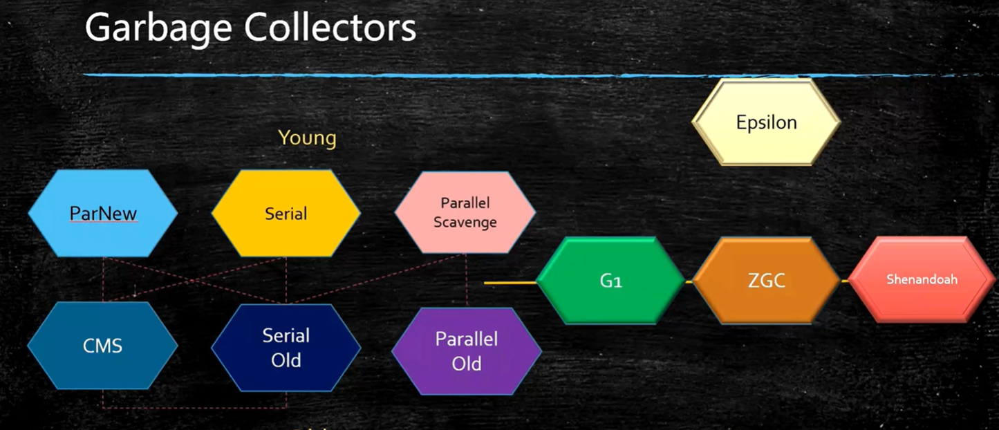

(https://www.bilibili.com/video/BV1AZ4y147fD?t=739)

# 第一天：Jvm垃圾回收快速入门

## 1、什么是垃圾？
> 在内存没有用处的内存

## 2、如何定位垃圾？

> 引用计数
> 根可达算法(jvm使用这个)

## 3、常用垃圾回收算法

> 标记清除(将垃圾标记为可用,容易产生内存垃圾)
>
> 拷贝(也叫复制算法 将内存一分为二)
>
> 标记压缩算法(效率比较低)

## 4、常用垃圾回收器

> 分代: 新生代,老年代,内存为1:1 新生代又分eden,survivor,survivor 8:1:1
>
> 新生代大量死去,存活,一般采用复制算法,老年代存活率高,一般采用标记清除和标记压缩
>
> 对象 -> 尝试在栈上分配->eden区->survivor1->survivor2->survivor1->...->old

1. serial ,serial  old.单线程 停止所有工作线程,然后清理垃圾 STW (适用于小内存)
2. parallel Scavenge,parallel old,多线程,停止所有工作线程,然后清理垃圾 STW(这个内存可以大点,多线程去清理)
3. ParNew(和parallel Scavenge类似,配合CMS使用)
4. CMS 工作在老年代,并行标记清除,初始标记->并发标记->重新标记->并发清理   并发标记使用三色标记法
5. G1,逻辑分代,物理不分代

## 5、系统上线前预估系统的内存占用情况

​	java -XX:+PrintCommandLineFlags -version

## 6、系统上线前预估系统的并发访问情况

## 7、根据预估值设定JVM初始参数

## 8、压力测试方法论

## 9、根据压测结果调整参数值

## 10、系统上线后设定日志参数

## 11、定期观察日志情况

## 12、根据日志解决实战问题

# 第二天：生产环境中的垃圾回收方法理论与动手实战

## 13、为什么一个百万级TPS系统会频繁GC？

## 14、定位JVM问题的实用参数设置

## 15、用top命令观察系统运行情况

## 16、用jps定位虚拟机进程

## 17、用jstat定位JVM问题

## 18、用jmap导出内存转储文件

## 19、用jstack定位问题线程

## 20、用jhat分析转储文件

## 21、其他给力的工具visual VM，MAT，Arthas介绍

## 22、动手实战

## 23、集中答疑，解决同学们学习中的问题

## 24、面向未来，学习路线指引与职业规划