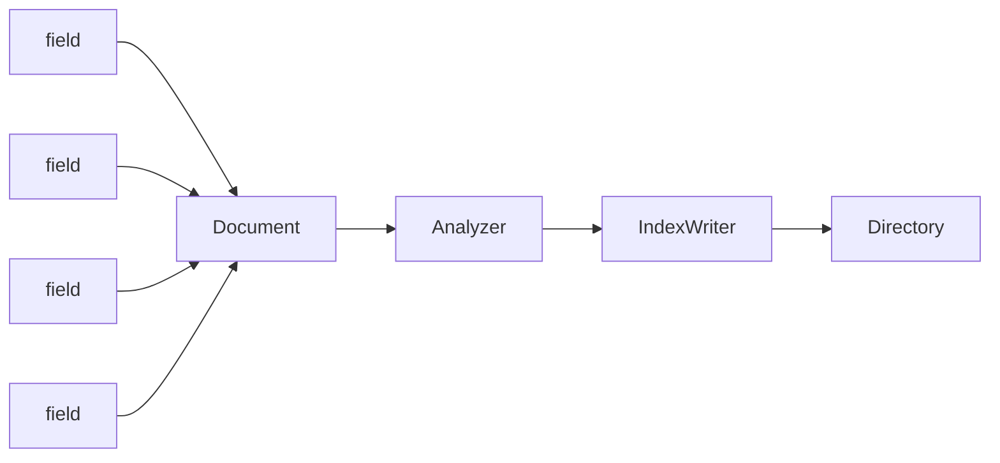

本文是Lucene学习的大概脉络,还需编辑优化

# 1. 索引类型

索引过程是由Lucene所提供的核心功能之一 ,IndexWriter 是索引过程中最重要的和核心组件。  IndexWriter用于创建或更新索引,而不是用来读取索引。 


##  1.1 IndexWriter 

> 创建以及更新索引的核心

目前只有一个构造函数:

```java
public IndexWriter(Directory d, IndexWriterConfig conf);
```

##  1.2 Directory 

> 表示索引的存储位置

##  1.3 Analyzer 

>  负责分析一个文件，并从将被索引的文本获取令牌/字 

##  1.4 Document 

>  Document代表一个虚拟文档与字段，其中字段是可包含在物理文档的内容，元数据等对象 

##  1.5 Field 

> 文档中的对应字段,一个文档可以包含多个字段.

# 2. 搜索类型

搜索也是由Lucene所提供的核心功能之一 ,主要用于搜索文档

## 2.1 IndexSearcher

>  这个类充当读取/搜索索引的过程后创建索引的核心组成部分。它需要目录实例指向包含索引的位置 

## 2.2  Term 

​	一般和Term一起使用

## 2.3  Query 

> 一般都是简单的查询

## 2.4  TermQuery 

> TermQuery，通过项查询

## 2.5  TopDocs 

> TopDocs 用于记录查询之后的结果,对其遍历便可以拿到所需要查询的所有数据


