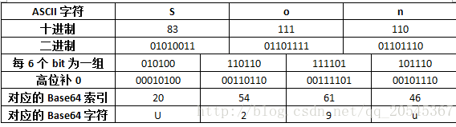

## 介绍

1. Base64是网络上最常见的用于传输8Bit字节码的编码方式之一，Base64就是一种基于64个可打印字符来表示二进制数据的方法.
2. Base64一般用于在HTTP协议下传输二进制数据，由于HTTP协议是文本协议，所以在HTTP协议下传输二进制数据需要将二进制数据转换为字符数据,然而直接转换是不行的。因为网络传输只能传输可打印字符。
3. 什么是可打印字符？在ASCII码中规定，0~31、127这33个字符属于控制字符，32~126这95个字符属于可打印字符，也就是说网络传输只能传输这95个字符，不在这个范围内的字符无法传输。
4. 如果要编码的二进制数据不是3的倍数，最后会剩下1个或2个字节怎么办？Base64用`\x00`字节在末尾补足后，再在编码的末尾加上1个或2个`=`号，表示补了多少字节，解码的时候，会自动去掉。
5. 那么该怎么才能传输其他字符呢？其中一种方式就是使用Base64。

### 1. 编码流程

base64自己有一个64个字符的编码表,编码过程就是将原ASCII码转换为符合base64码的规则. 最终的表现形式为:

> 3位的ASCII码转为4位的base64嘛,不足的话就采用后补0的方式补足

1. 将3位base64码转为二进制: 3 * 8 = 24位
2. 将24位二进制拆分为 4*6的4组码
3. 将拆分之后的每组二进制码前补两个0
4. 根据编码表生成最终的4位字符



### 2.  java代码

java1.8之后就继承base64的编码和解码功能

根据RFC822规定，BASE64Encoder编码每76个字符，还需要加上一个回车换行.在实际处理的时候要考虑换行符的问题

```java
public class Base64Test {
    @Test
    public void encode(){
        BASE64Encoder encoder = new BASE64Encoder();
        Assert.assertEquals(encoder.encode("Son".getBytes()), "U29u");
        Assert.assertEquals(encoder.encode("S".getBytes()), "Uw==");
    }

    @Test
    public void decode() throws Exception{
        BASE64Decoder decoder = new BASE64Decoder();
        Assert.assertEquals(new String(decoder.decodeBuffer("U29u")), "Son");
        Assert.assertEquals(new String(decoder.decodeBuffer("Uw==")), "S");

    }
}
```

